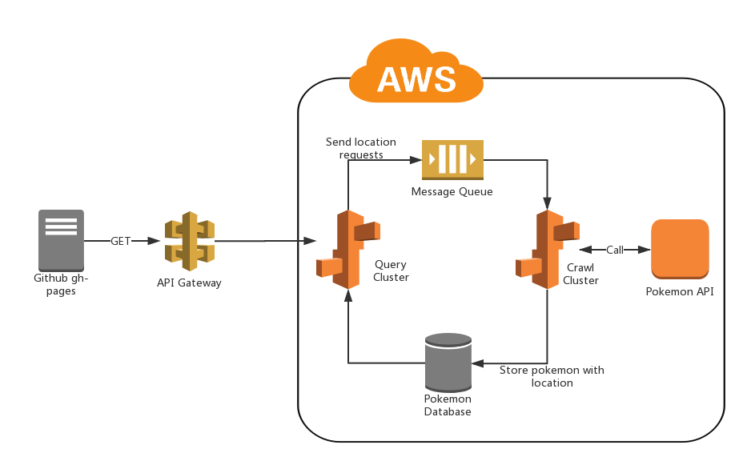

#Mock Pokemon Map

####TO DO LIST:
- Optimize query logic so that it won't send messages that contains the same lcoation infomation.(REDIS)
- Add code snippets to clear RDS regularly.
- Add more feature to website.
- Measurement of the application.

####Architecture

- Frontend
	- Used Github gh-pages to hold our frontend website.
	- Used Bing Map V8 API to present our map.
	- Used SDK generated by AWS API Gateway to send query request to Query Server.
- Backend
	- We have two server clusters, Query cluster and Crawl cluser.
	- Used Django framework to build Query cluster and Crawl cluster.
	- Query cluster get location information from frontend, then transform them to cell ids, and send message containing cell ids infomation to message queue.
	- At the same time, Query cluster get corresponding pokemon data from pokemon database.
	- Crawl cluster receive message from message queue and crawl pokemon data by calling Pokemon API.
	- Once get result of pokemon API, Crawl cluster write pokemon write pokemon data to database.
- About Pokemon API
	- The old version of Pokemon API found in github doesn't work now. Maybe Niantic blocked it. So we use mock pokemon api instead.

####Toolset
- Python
- Django
- AWS EC2, API Gateway, RDS, Elastic Beanstalk, IAM, SQS, Git